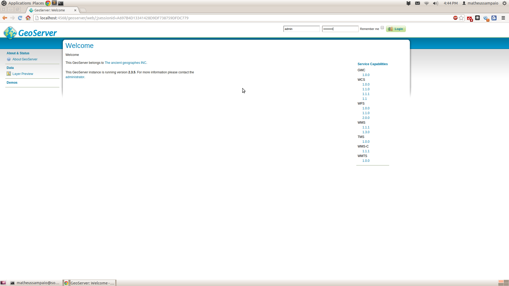
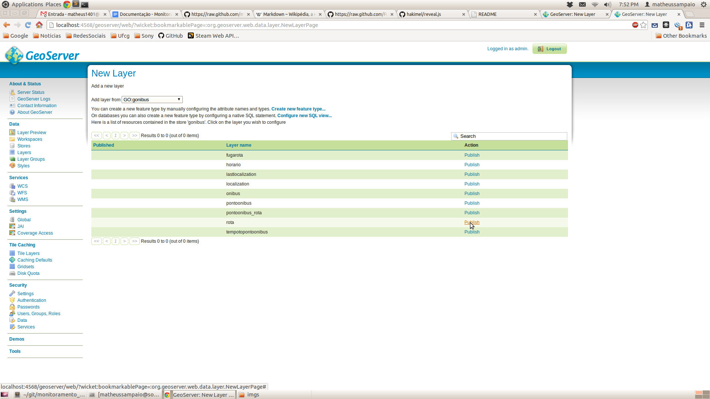
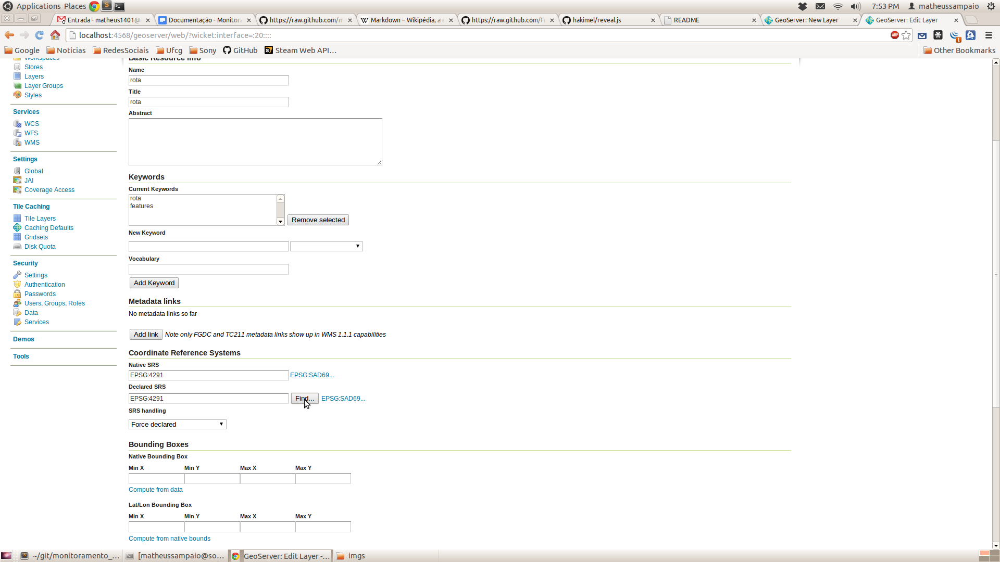
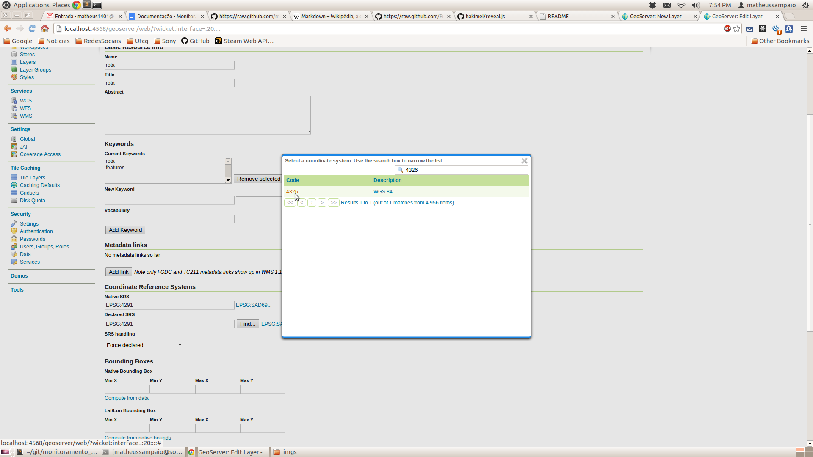
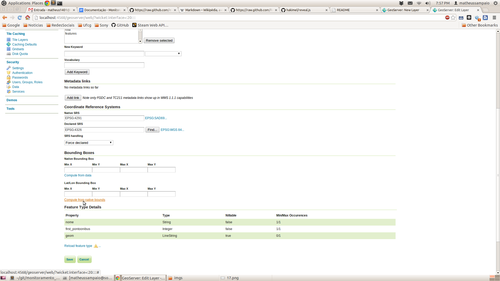
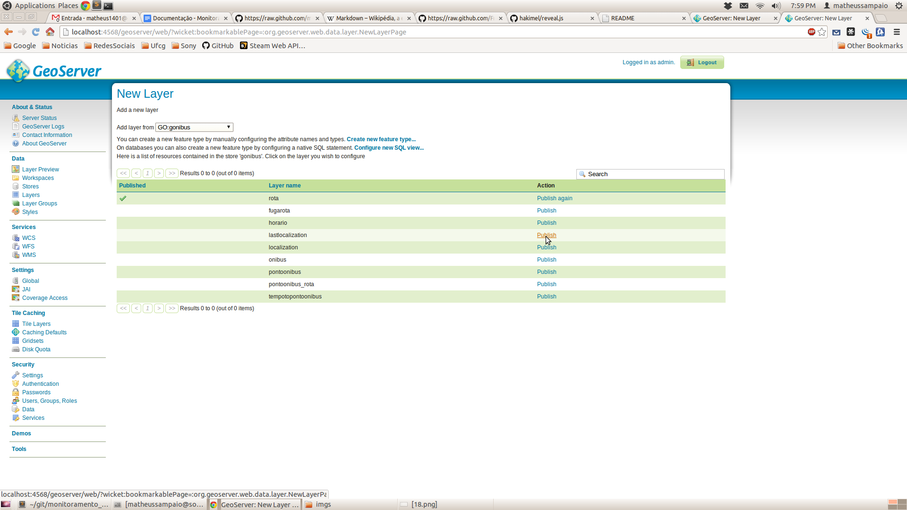
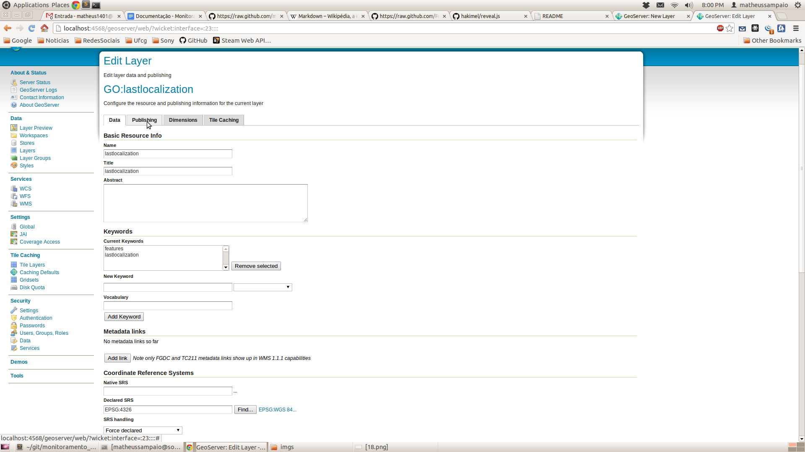
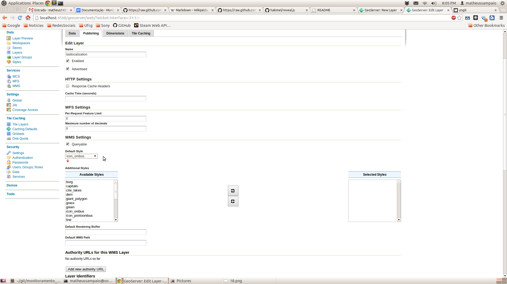
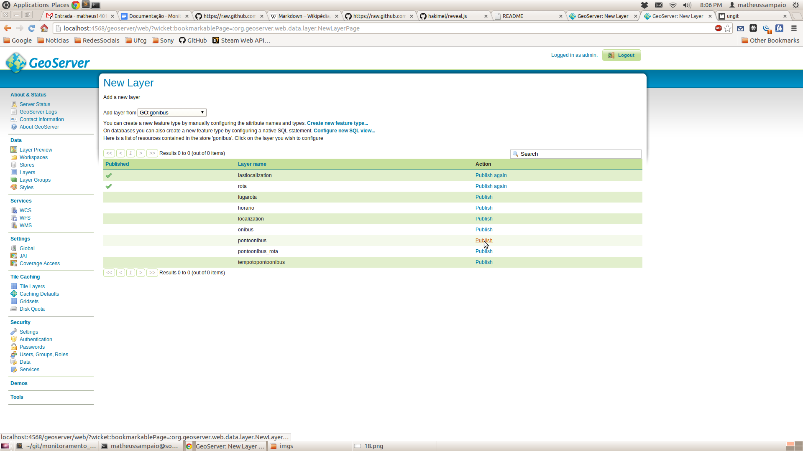
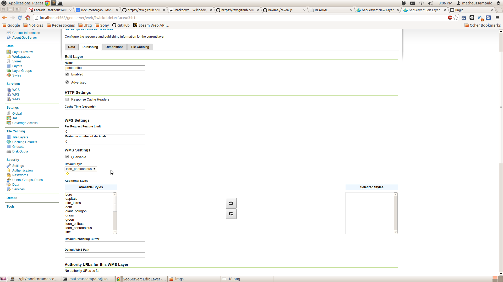

Monitoramento de Ônibus
====================

Sistema para monitorar transportes públicos baseado em localização.

##Dependências :

É necessário ter instalado o [VirtualBox][2], [Vagrant][3] e o [Git][4]. No Ubuntu podem seguir o comando:

```
user@sony:~$ sudo apt-get install virtualbox
user@sony:~$ sudo apt-get install vagrant
user@sony:~$ sudo apt-get install git
```

##Instalação :

Devemos clonar o [projeto][0] do GitHub:

```
user@sony:~$ git clone https://github.com/matheussampaio/monitoramento_onibus.git
```

E executarmos o vagrant:

```
user@sony:~/monitoramento_onibus$ vagrant up
```

O vagrant irá criar uma maquina virtual do Ubuntu 12.04 x86 e irá instalar toda as dependências do projeto. O proximo passo é configurar o GeoServer.


##Configurando o GeoServer :

Após terminar a instalação, o GeoServer do servidor estará acessível através deste [link][5].

Use o nome de usuário <b>admin</b> e a senha <b>geoserver</b> para autenticar-se.
[](imgs/1.png)

Clique em <b>Layers</b>.
[](imgs/12.png)

Clique em <b>Add a new resource</b>.
[](imgs/13.png)

Em <i>Add a new layer from</i> selecione <b>GO</b>.
[](imgs/14.png)

Na linha de <i>rota</i> clique em <b>Publish</b>.
[](imgs/15.png)

Clique em <b>Find</b>.
[](imgs/16.png)

No campo de pesquisa digite <b>4326</b> e aperte <b>Enter</b>, em seguite clique no código <b>4326</b>.
[](imgs/17.png)

Clique em <b>Compute from native bounds</b> e em seguida clique em <b>Save</b>.
[](imgs/18.png)

Clique em <b>Layers</b>.
[](imgs/12.png)

Clique em <b>Add a new resource</b>.
[](imgs/13.png)

Em <i>Add a new layer from</i> selecione <b>GO</b>.
[](imgs/14.png)

Na linha de <i>lastlocalization</i> clique em <b>Publish</b>.
[](imgs/19.png)

Clique em <b>Find</b>.
[](imgs/16.png)

No campo de pesquisa digite <b>4326</b> e aperte <b>Enter</b>, em seguite clique no código <b>4326</b>.
[](imgs/17.png)

Clique em <b>Compute from native bounds</b>.
[](imgs/18.png)

Clique em <b>Publishing</b>.
[](imgs/20.png)

Em <i>default style</i> selecione <b>icon_onibus</b> e em seguida clique em <b>Save</b>.
[](imgs/21.png)

Clique em <b>Layers</b>.
[](imgs/12.png)

Clique em <b>Add a new resource</b>.
[](imgs/13.png)

Em <i>Add a new layer from</i> selecione <b>GO</b>.
[](imgs/14.png)

Na linha de <i>pontoonibus</i> clique em <b>Publish</b>.
[](imgs/22.png)

Clique em <b>Find</b>.
[](imgs/16.png)

No campo de pesquisa digite <b>4326</b> e aperte <b>Enter</b>, em seguite clique no código <b>4326</b>.
[](imgs/17.png)

Clique em <b>Compute from native bounds</b>.
[](imgs/18.png)

Clique em <b>Publishing</b>.
[](imgs/20.png)

Em <i>default style</i> selecione <b>icon_pontoonibus</b> e em seguida clique em <b>Save</b>.
[](imgs/23.png)

Agora o GeoServer está configurado com todas as layers e styles usados pelo projeto. Agora vamos para o ultimo passo: iniciar o projeto.


## Iniciando o Projeto :

Voltemos até a pasta do projeto no Host:

```
user@sony:~$ cd monitoramento_onibus
```

Fazemos SSH na VM do vagrant:
```
user@sony:~monitoramento_onibus$ vagrant ssh
```

No Cliente, navegamos até a pasta monitoramento_onibus/src:
```
vagrant@precise32:~$ cd monitoramento_onibus/src
```

Antes desse passo procure saber o seu IP interno (Por exemplo 192.168.1.244). Após descobrir, execute o comando abaixo substituindo pelo seu IP (Inclua :4568):
```
vagrant@precise32:~/monitoramento_onibus/src$ node server.js 192.168.1.244:4568
Server on.
http://localhost:3001

```

O projeto está completamente instalado e funcionando, a partir desse passo você já pode acessar o [site][6] e usa-lo.

##Licença :

O código está disponivel em um [projeto][0] no GitHub sobre a licença [GPL v3][1]

[0]: https://github.com/matheussampaio/monitoramento_onibus
[1]: http://www.gnu.org/copyleft/gpl.html
[2]: https://www.virtualbox.org/
[3]: http://www.vagrantup.com/
[4]: http://git-scm.com/
[5]: http://localhost:4568/geoserver
[6]: http://localhost:4567
