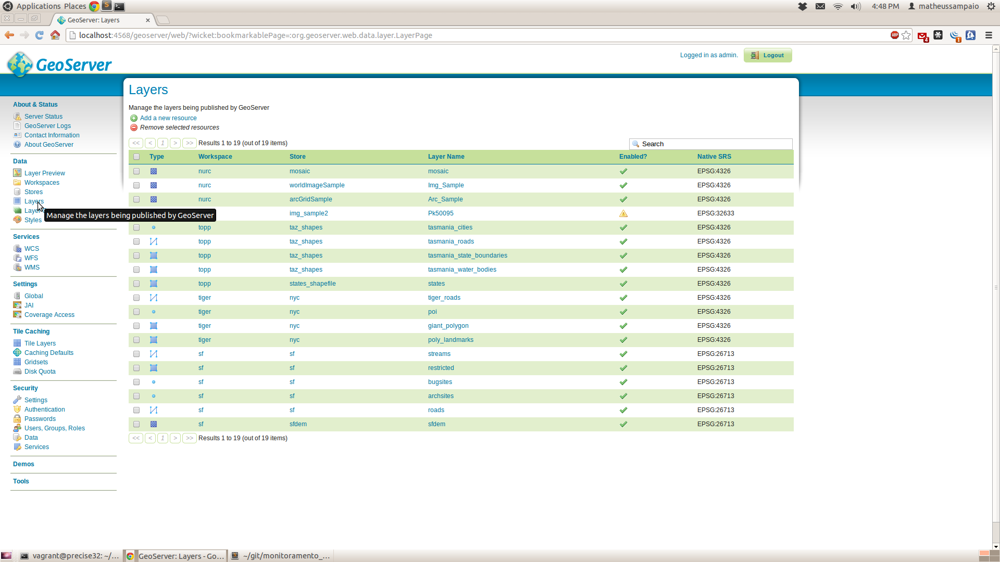
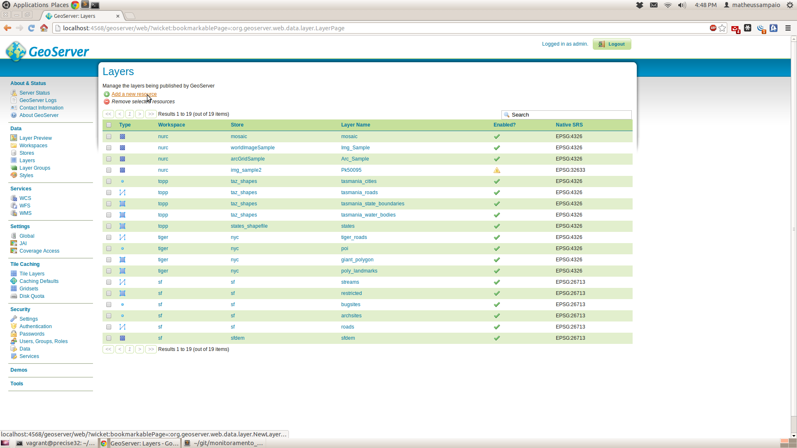
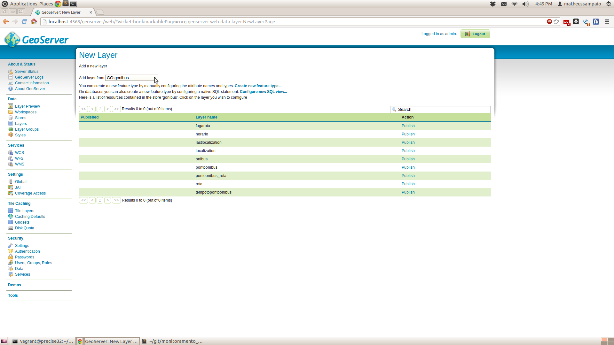

[](https://travis-ci.org/monitoramento_onibus/sig)

Monitoramento de Ônibus
====================

Sistema para monitorar transportes públicos baseado em localização.

##Dependências :

É necessário ter instalado o [VirtualBox][2], [Vagrant][3] e o [Git][4]. No Ubuntu podem seguir o comando:

```
user@sony:~$ sudo apt-get install virtualbox
user@sony:~$ sudo apt-get install vagrant
user@sony:~$ sudo apt-get install git
```

##Instalação :

Devemos clonar o [projeto][0] do GitHub:

```
user@sony:~$ git clone https://github.com/matheussampaio/monitoramento_onibus.git
```

Ir até a pasta monitoramento_onibus/vagrant:

```
user@sony:~$ cd monitoramento_onibus/vagrant
```

E executarmos o vagrant:

```
user@sony:~/monitoramento_onibus/vagrant$ vagrant up
```

O vagrant irá criar uma maquina virtual do Ubuntu 12.04 x86 e irá instalar toda as dependências do projeto. O ultimo passo é configurar o GeoServer.

##Configurando o GeoServer :

Após terminar a instalação, o GeoServer do servidor estará acessível através deste [link][5].

Use o nome de usuário <b>admin</b> e a senha <b>geoserver</b> para autenticar-se.
[](imgs/1.png)

Clique em <b>Workspaces</b>.
[](imgs/2.png)

Clique em <b>Add new workspace</b>.
[](imgs/3.png)

Em <i>Name</i> digite <b>GO</b> e em <i>Namespace URI</i> digite <b>http://localhost:8080/geoserver/GO</b>, em seguida, clique em <b>Submit</b>.
[](imgs/4.png)

Clique em <b>Stores</b>.
[](imgs/5.png)

Clique em <b>Add new Store</b>.
[](imgs/6.png)

Clique em <b>PostGIS</b>.
[](imgs/7.png)

Selecione o <i>Workspace</i> <b>GO</b>, em <i>Data Source Name</i> adicione <b>gonibus</b>, em <i>Database</i> adicione <b>gonibus</b>, em <i>User</i> adicione <b>postgres</b>, em <i>passwd</i> adicione <b>postgres</b> e em seguida clique em <b>Save</b>.
[](imgs/8.png)

Clique em <b>Styles</b>.
[](imgs/9.png)

Clique em <b>Add a new Style</b>.
[](imgs/10.png)

Em <i>Name</i> adicione <b>icon_pontoonibus</b>, em <i>Workspace</i> selecione <b>GO</b>, cole o texto abaixo e clique em <b>Submit</b>.
```
<?xml version="1.0" encoding="ISO-8859-1"?>
<StyledLayerDescriptor version="1.0.0" 
 xsi:schemaLocation="http://www.opengis.net/sld StyledLayerDescriptor.xsd" 
 xmlns="http://www.opengis.net/sld" 
 xmlns:ogc="http://www.opengis.net/ogc" 
 xmlns:xlink="http://www.w3.org/1999/xlink" 
 xmlns:xsi="http://www.w3.org/2001/XMLSchema-instance">
  <!-- a Named Layer is the basic building block of an SLD document -->
  <NamedLayer>
    <Name>default_point</Name>
    <UserStyle>
    <!-- Styles can have names, titles and abstracts -->
      <Title>Default Point</Title>
      <Abstract>A sample style that draws a point</Abstract>
      <!-- FeatureTypeStyles describe how to render different features -->
      <!-- A FeatureTypeStyle for rendering points -->
      <FeatureTypeStyle>
        <Rule>
          <Name>rule1</Name>
          <Title>Red Square</Title>
          <Abstract>A 6 pixel square with a red fill and no stroke</Abstract>
            <PointSymbolizer>
              <Graphic>
                <ExternalGraphic>
                  <OnlineResource
                     xlink:type="simple"
                  xlink:href="/home/vagrant/monitoramento_onibus/src/img/icon_ponto_onibus.png" />
                   <Format>image/png</Format>
                 </ExternalGraphic>
              <Size>100</Size>
            </Graphic>
          </PointSymbolizer>
          <TextSymbolizer>
            <Label>
              <ogc:PropertyName>nome</ogc:PropertyName>
            </Label>
            <Font>
              <CssParameter name="font-family">Arial</CssParameter>
              <CssParameter name="font-size">12</CssParameter>
              <CssParameter name="font-style">normal</CssParameter>
              <CssParameter name="font-weight">bold</CssParameter>
            </Font>
            <LabelPlacement>
              <PointPlacement>
                <AnchorPoint>
                  <AnchorPointX>0.5</AnchorPointX>
                  <AnchorPointY>0.0</AnchorPointY>
                </AnchorPoint>
                <Displacement>
                  <DisplacementX>0</DisplacementX>
                  <DisplacementY>50</DisplacementY>
                </Displacement>
              </PointPlacement>
            </LabelPlacement>
            <Fill>
              <CssParameter name="fill">#000000</CssParameter>
            </Fill>
          </TextSymbolizer>
        </Rule>
      </FeatureTypeStyle>
    </UserStyle>
  </NamedLayer>
</StyledLayerDescriptor>
```
[](imgs/11.png)

Clique em <b>Styles</b>.
[](imgs/9.png)

Clique em <b>Add a new Style</b>.
[](imgs/10.png)

Em <i>Name</i> adicione <b>icon_onibus</b>, em <i>Workspace</i> selecione <b>GO</b>, cole o texto abaixo e clique em <b>Submit</b>.
```
<?xml version="1.0" encoding="ISO-8859-1"?>
<StyledLayerDescriptor version="1.0.0" 
 xsi:schemaLocation="http://www.opengis.net/sld StyledLayerDescriptor.xsd" 
 xmlns="http://www.opengis.net/sld" 
 xmlns:ogc="http://www.opengis.net/ogc" 
 xmlns:xlink="http://www.w3.org/1999/xlink" 
 xmlns:xsi="http://www.w3.org/2001/XMLSchema-instance">
  <!-- a Named Layer is the basic building block of an SLD document -->
  <NamedLayer>
    <Name>default_point</Name>
    <UserStyle>
    <!-- Styles can have names, titles and abstracts -->
      <Title>Default Point</Title>
      <Abstract>A sample style that draws a point</Abstract>
      <!-- FeatureTypeStyles describe how to render different features -->
      <!-- A FeatureTypeStyle for rendering points -->
      <FeatureTypeStyle>
        <Rule>
          <Name>rule1</Name>
          <Title>Red Square</Title>
          <Abstract>A 6 pixel square with a red fill and no stroke</Abstract>
            <PointSymbolizer>
              <Graphic>
                <ExternalGraphic>
                  <OnlineResource
                     xlink:type="simple"
                  xlink:href="/home/vagrant/monitoramento_onibus/src/img/icon_onibus.png" />
                   <Format>image/png</Format>
                 </ExternalGraphic>
              <Size>100</Size>
            </Graphic>
          </PointSymbolizer>
          <TextSymbolizer>
            <Label>
              <ogc:PropertyName>placa</ogc:PropertyName>
            </Label>
            <Font>
              <CssParameter name="font-family">Arial</CssParameter>
              <CssParameter name="font-size">12</CssParameter>
              <CssParameter name="font-style">normal</CssParameter>
              <CssParameter name="font-weight">bold</CssParameter>
            </Font>
            <LabelPlacement>
              <PointPlacement>
                <AnchorPoint>
                  <AnchorPointX>0.5</AnchorPointX>
                  <AnchorPointY>0.0</AnchorPointY>
                </AnchorPoint>
                <Displacement>
                  <DisplacementX>0</DisplacementX>
                  <DisplacementY>50</DisplacementY>
                </Displacement>
              </PointPlacement>
            </LabelPlacement>
            <Fill>
              <CssParameter name="fill">#000000</CssParameter>
            </Fill>
          </TextSymbolizer>
        </Rule>
      </FeatureTypeStyle>
    </UserStyle>
  </NamedLayer>
</StyledLayerDescriptor>
```
[](imgs/11.png)

Clique em <b>Layers</b>.
[](imgs/12.png)

Clique em <b>Add a new resource</b>.
[](imgs/13.png)

Em <i>Add a new layer from</i> selecione <b>GO</b>.
[](imgs/14.png)

Na linha de <i>rota</i> clique em <b>Publish</b>.
[](imgs/15.png)

Clique em <b>Find</b>.
[](imgs/16.png)

No campo de pesquisa digite <b>4326</b> e aperte <b>Enter</b>, em seguite clique no código <b>4326</b>.
[](imgs/17.png)

Clique em <b>Compute from native bounds</b> e em seguida clique em <b>Save</b>.
[](imgs/18.png)

Clique em <b>Layers</b>.
[](imgs/12.png)

Clique em <b>Add a new resource</b>.
[](imgs/13.png)

Em <i>Add a new layer from</i> selecione <b>GO</b>.
[](imgs/14.png)

Na linha de <i>lastlocalization</i> clique em <b>Publish</b>.
[](imgs/19.png)

Clique em <b>Find</b>.
[](imgs/16.png)

No campo de pesquisa digite <b>4326</b> e aperte <b>Enter</b>, em seguite clique no código <b>4326</b>.
[](imgs/17.png)

Clique em <b>Compute from native bounds</b>.
[](imgs/18.png)

Clique em <b>Publishing</b>.
[](imgs/20.png)

Em <i>default style</i> selecione <b>icon_onibus</b>.


##Licença :

O código está disponivel em um [projeto][0] no GitHub sobre a licença [GNU General Public License][1]

[0]: https://github.com/matheussampaio/monitoramento_onibus
[1]: http://www.gnu.org/copyleft/gpl.html
[2]: https://www.virtualbox.org/
[3]: http://www.vagrantup.com/
[4]: http://git-scm.com/
[5]: http://localhost:4568/geoserver